# 集群功能全方位 UI 测试文档（图文步骤）

> 实测时间：2026-09-10 16:10 – 17:35（本地时区 UTC+8）
> 测试环境：单机双节点模拟（center + worker 同机两个代码副本），详见 [cluster-mock-test-steps.md](../cluster-mock-test-steps.md)
> 结论速览：**A–H 共 8 组全部执行完毕，主链路（下发/同步/停止/撤销/治理/故障恢复）全部通过；发现 2 个产品缺陷，见文末「已知缺陷」。**

---

## 0. 前置条件与测试环境

| 项目 | center（中心） | worker（工作节点） |
|---|---|---|
| 代码目录 | `D:\WorkPlace\Pycharm\modelctl` | `D:\WorkPlace\Pycharm\modelctl\mock-worker` |
| 角色 | `CLUSTER_ROLE=both` | `CLUSTER_ROLE=worker` |
| node_id | 不适用（center 不注册自身） | `w-mock-01` |
| Web UI | `http://127.0.0.1:4173` | `http://127.0.0.1:4183` |
| 心跳端口 | 18900（worker 主动连入） | — |

复现前检查清单：

1. center webui 已启动：`modelctl webui status`（主 venv），浏览器打开 `http://127.0.0.1:4173`。
2. worker webui 已启动（mock-worker venv）：`mock-worker\venv\Scripts\modelctl.exe webui status`。
3. worker 的 `.env` 中 `CLUSTER_CENTER_URL=http://127.0.0.1:18900`、`CLUSTER_NODE_TOKEN` 与中心一致。
4. 登录：打开 center UI 会先进登录页，口令即 center `.env` 里的 `API_KEY`。登录后所有集群页面均可访问。
5. 所有截图均在 **center UI（4173）** 拍摄；CLI 断言在 center 目录用主 venv 的 `modelctl.exe` 执行（标注 worker 的除外）。

> 提示：节点列表页有约 5 秒自动轮询，状态变化（心跳、掉线、恢复）无需手动刷新即可看到。

---

## 测试组 A：集群节点列表

### A-1 查看节点总览

1. 登录后点击左侧导航「**集群**」（URL：`/cluster/nodes`）。
2. 观察页头「角色 both · N/3 online」与节点表格。

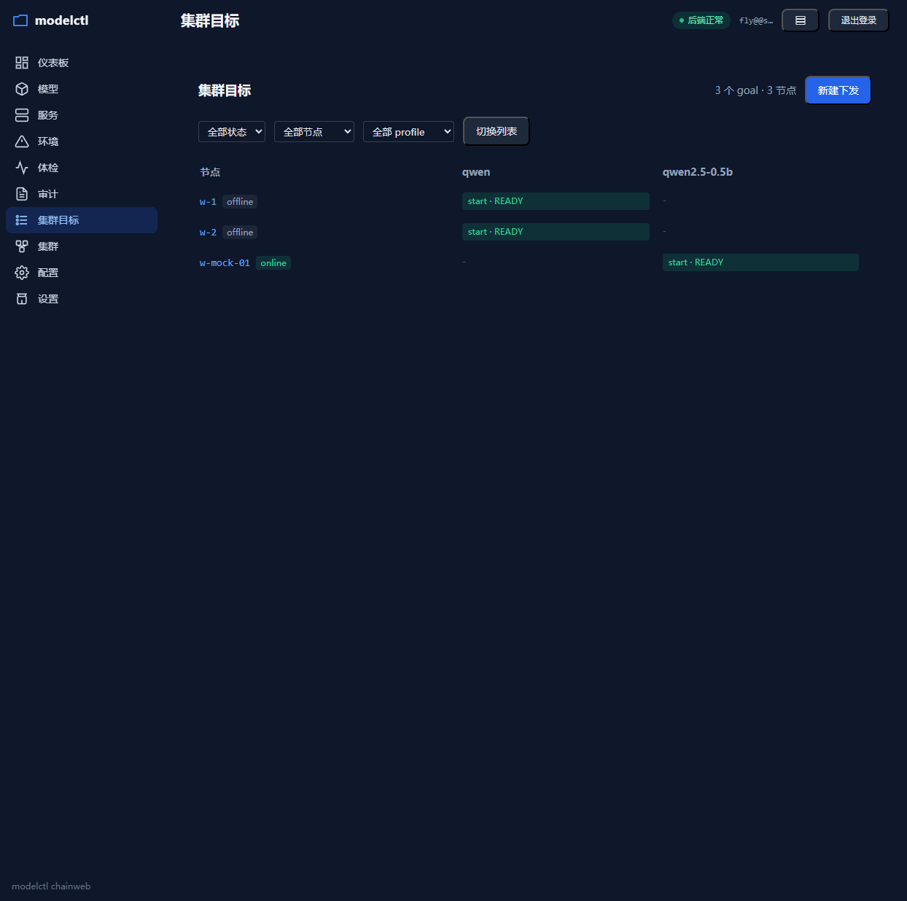

**预期结果**

- 表格列：节点 / LAN / 角色 / 容量 / 状态 / 最后心跳 / 租约剩余 / 主机。
- `w-1`、`w-2`（历史残留的假节点）显示 `offline`，最后心跳为很大的分钟数。
- `w-mock-01` 显示 `online`（绿色徽标）、最后心跳 < 90s、租约剩余 > 0、主机为本机名。
- ⚠️ center 自身**不会**出现在列表中（both 角色未配 `CLUSTER_CENTER_URL/NODE_ID` 时不注册），这是预期行为。

**CLI 断言**

```powershell
modelctl cluster nodes
# w-mock-01 行：状态 online，最后心跳(s) < 90，租约剩余(s) ≤ 90
```

---

## 测试组 B：集群目标视图（矩阵 / 列表 / 筛选）

### B-1 矩阵视图

1. 左侧导航点击「**集群目标**」（URL：`/cluster/goals`），默认进入列表视图。
2. 点击右上角「**切换矩阵**」按钮。

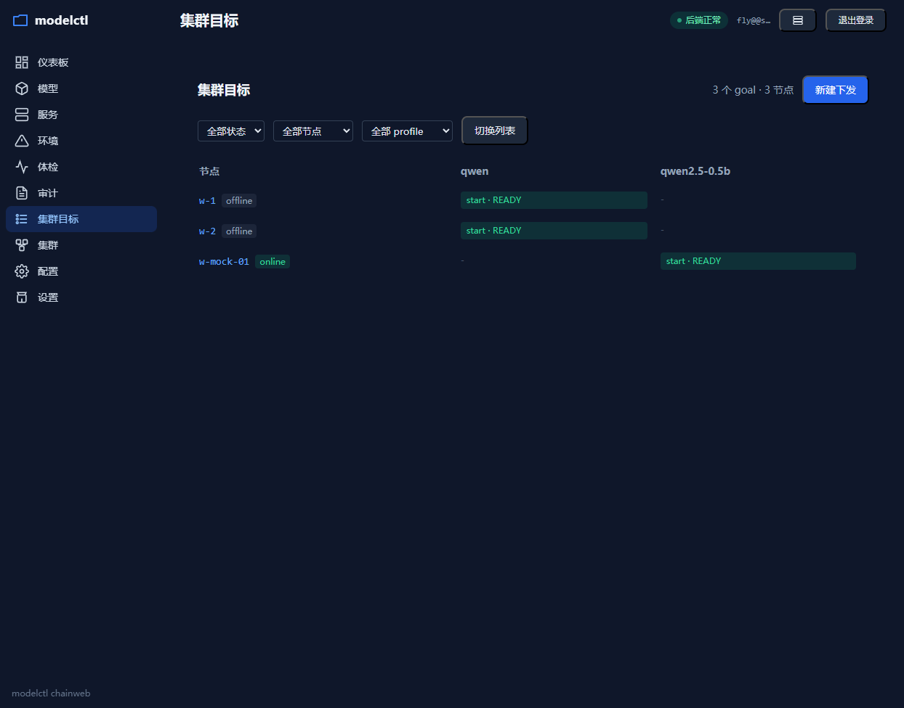

**预期结果**：矩阵以「节点 × profile」网格呈现，单元格显示 stage 徽标（READY 绿色等），空格表示该节点无此 goal。

### B-2 列表视图 + 筛选器

1. 再点「切换列表」回到列表视图。
2. 依次操作三个下拉筛选：「全部状态」「全部节点」「全部 profile」，例如选节点 `w-mock-01`。


**预期结果**：列表列包含 节点/profile/engine/intent/stage/实际/gpu 端口/更新时间/动作；筛选后仅显示匹配行；页头显示「N 个 goal · M 节点」。

**CLI 断言**

```powershell
modelctl cluster goal list
modelctl cluster goal list --node w-mock-01
```

---

## 测试组 C：新建下发（dry-run 预览 → 确认提交）

### C-1 打开下发抽屉

1. 集群目标页右上角点击「**新建下发**」，右侧滑出「批量下发 goal」抽屉。

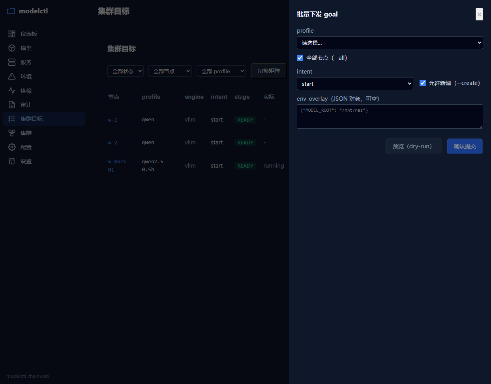

### C-2 填写表单

1. `profile`：选 `qwen2.5-1.5b`。
2. `engine`（同名 YAML 多引擎必须选边）：选 `vllm`。
3. 目标节点：勾选 `w-mock-01 online · 1 卡 / 6 GiB`（`w-1`/`w-2` 为 offline 置灰样式）。
4. `intent`：`start`；勾选「允许新建（--create）」。
5. `env_overlay`（可选）：填 `{"MODEL_ROOT": "/mnt/nas"}`。

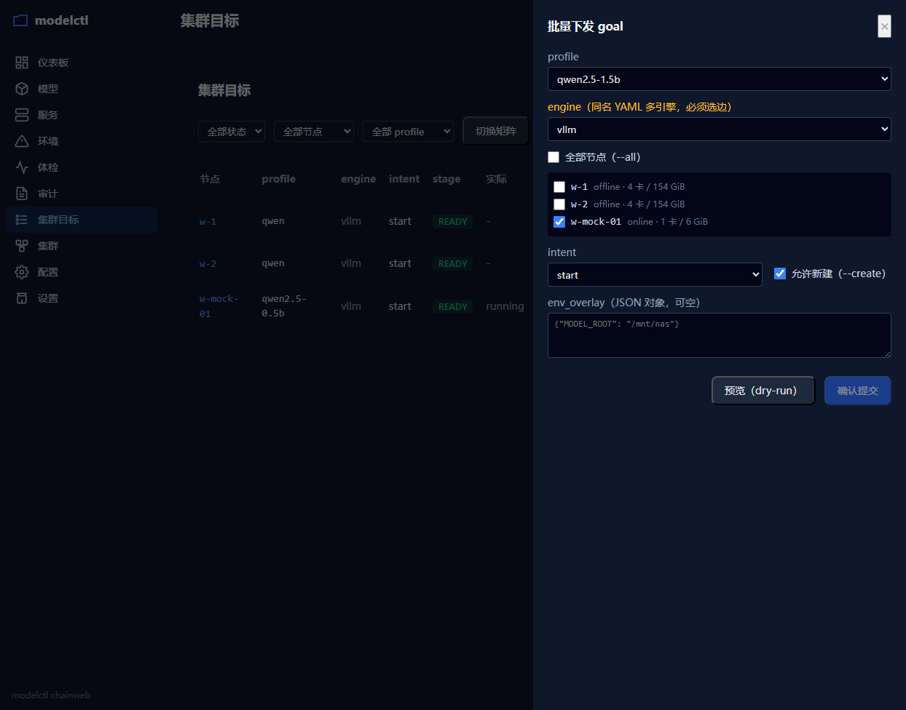

### C-3 dry-run 预览

1. 点击「**预览（dry-run）**」。

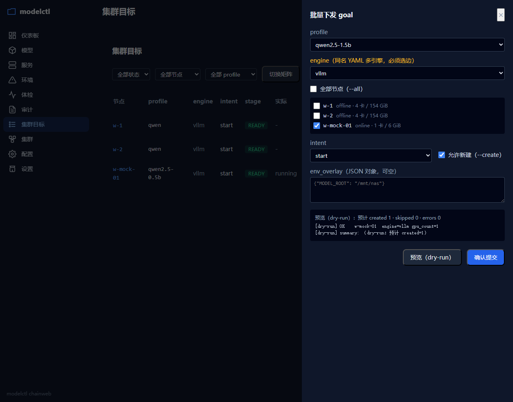

**预期结果**：预览区输出结构化报告：

```
预览（dry-run）：预计 created 1 · skipped 0 · errors 0
[dry-run] OK    w-mock-01  engine=vllm gpu_count=1
[dry-run] summary: （dry-run：预计 created=1）
```

只有 dry-run **无 ERR** 时「确认提交」才真正下发（两段式安全设计）。

### C-4 提交并观察 stage 推进

1. 点击「**确认提交**」，抽屉关闭，列表出现新 goal 行。
2. 连续观察 stage 列推进：`PENDING_PROFILE_SYNC → PROFILE_SYNCED → STARTING → READY`（模型加载耗时取决于引擎，mock 环境 vllm 容器就绪约需 1–3 分钟）。

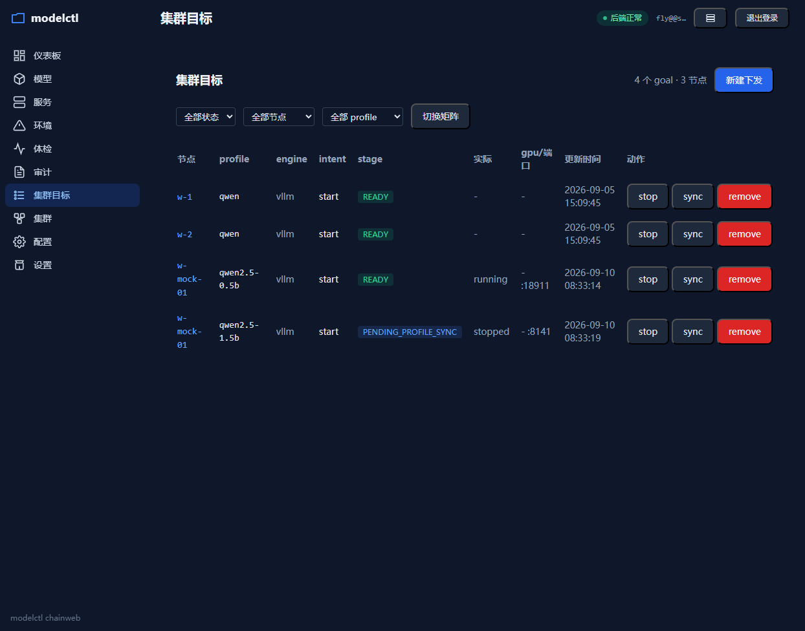

**预期结果**：最终该行 stage=`READY`、实际=`running`；页头 goal 计数 +1。

**CLI / 容器断言**

```powershell
modelctl cluster goal list --node w-mock-01        # qwen2.5-1.5b start READY
docker ps --format "{{.Names}} {{.Ports}}"          # 出现 qwen2.5-1.5b-vllm 容器
Invoke-WebRequest http://127.0.0.1:8107/health -UseBasicParsing   # 200（注意：见缺陷 1，实际端口是 8107 而非 UI 显示的 8141）
```

---

## 测试组 D：行内动作（sync / stop / remove）

### D-1 强制全量同步（sync）

1. 集群目标列表，找到 `w-mock-01 / qwen2.5-0.5b` 行，点击「**sync**」。

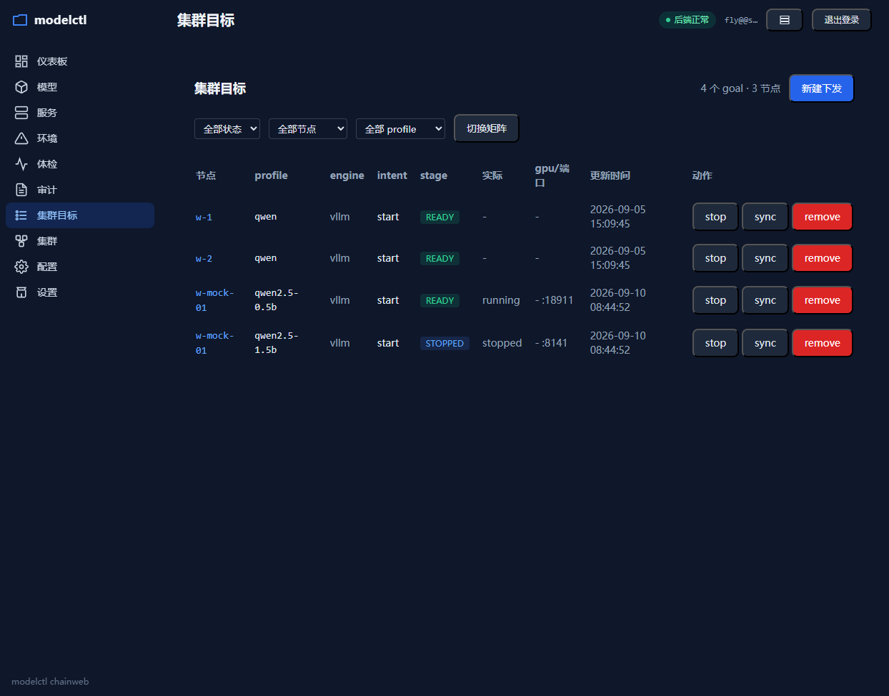

**预期结果**：页面提示同步指令已下发；profile yaml 会被中心版本覆盖回 worker。

**CLI 断言**：`modelctl cluster events --node w-mock-01` 出现 `node.sync 强制全量同步（操作者 api）`。

### D-2 停止（stop）

1. 点击 `qwen2.5-1.5b` 行的「**stop**」。

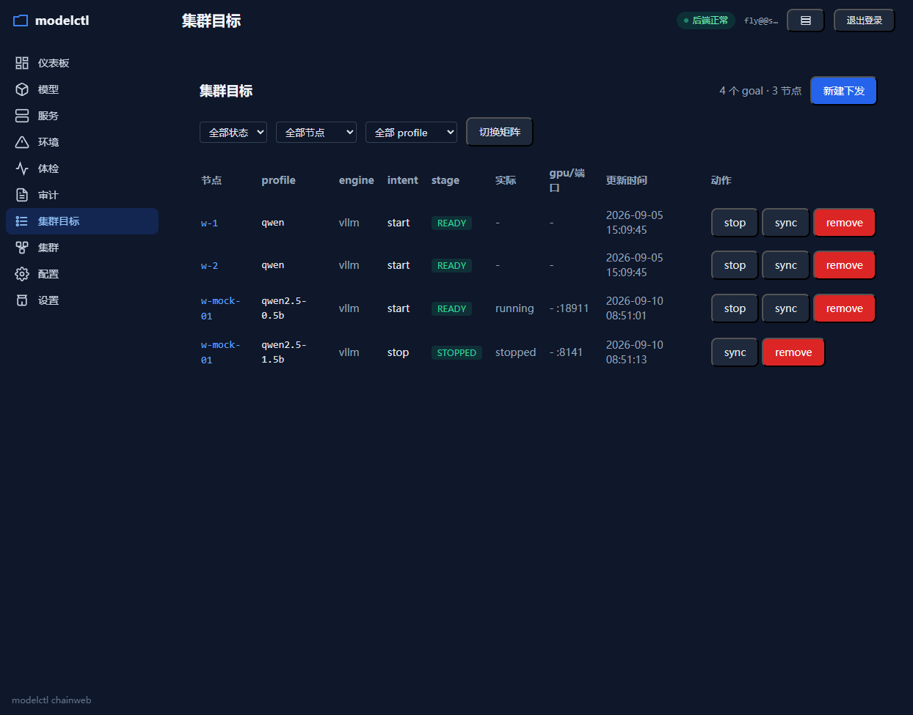

**预期结果**：该 goal 行 intent 变 `stop`，stage 在 worker 回执后变 `STOPPED`（紫色徽标），动作列不再显示 stop/sync。

**CLI 断言**

```powershell
modelctl cluster goal list --node w-mock-01
# qwen2.5-1.5b 行：intent=stop stage=STOPPED
modelctl cluster events --node w-mock-01
# goal.update 更新目标（qwen2.5-1.5b 字段 intent；操作者 api）
```

> ⚠️ 本步实测发现 **缺陷 2**：中心 stage 变 STOPPED，但 docker 容器并未被杀掉，详见文末。

### D-3 撤销目标（remove，带确认弹窗）

1. 点击 `qwen2.5-1.5b` 行的「**remove**」（红色按钮）。
2. 弹出确认对话框，需**手动输入节点/目标标识**确认，防止误删。

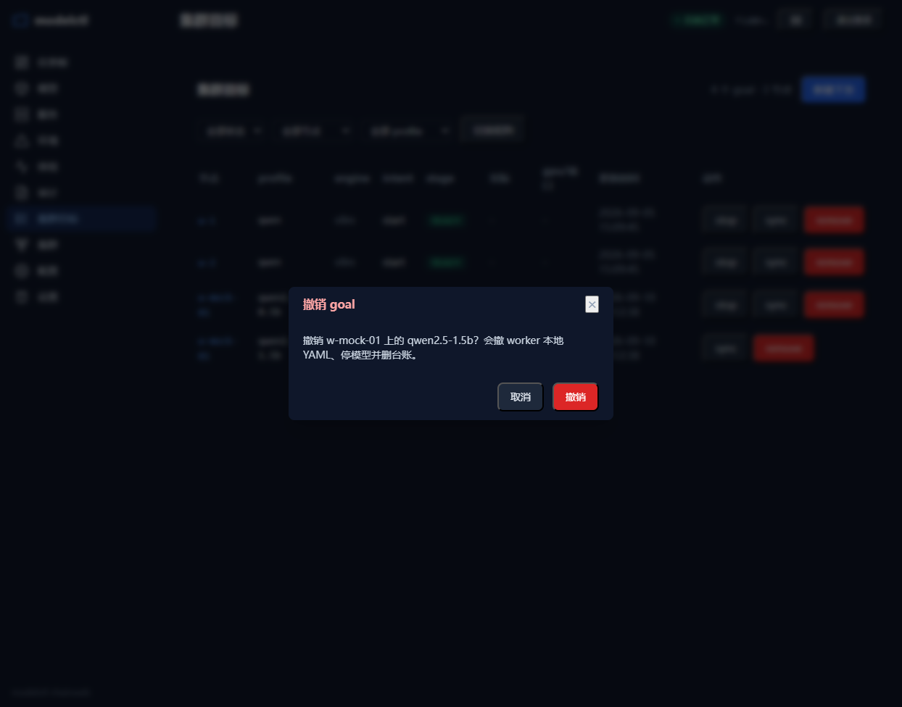

3. 确认后点击对话框的确认按钮。

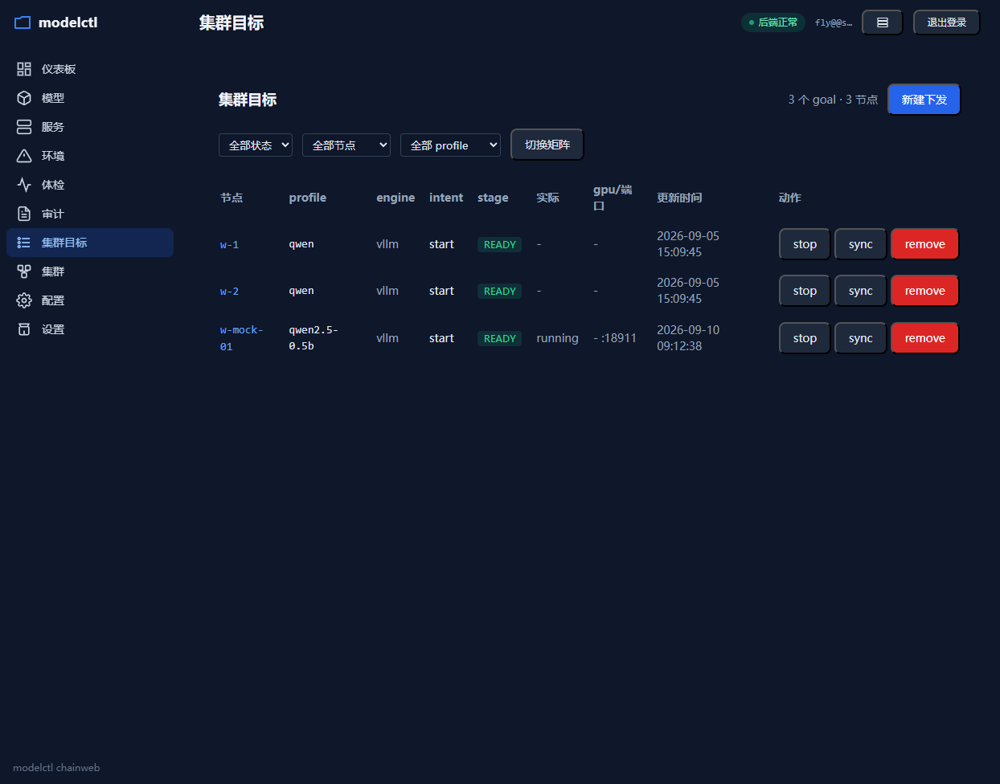

**预期结果**：该 goal 从列表消失，goal 计数 -1；事件流出现 `goal.delete 撤销目标（qwen2.5-1.5b；操作者 api）`。

---

## 测试组 E：节点详情与事件流

### E-1 节点详情头部

1. 集群节点列表点击 `w-mock-01` 节点名（URL：`/cluster/nodes/w-mock-01`）。


**预期结果**：展示节点基础信息（状态/主机/LAN/容量/租约）+ 该节点 goals 表（profile/engine/intent/stage/实际/gpu 端口）+ 运行事实表（worker 回流的每个 profile 实际状态）。

### E-2 事件流

1. 页内向下滚动到「事件流」区块。

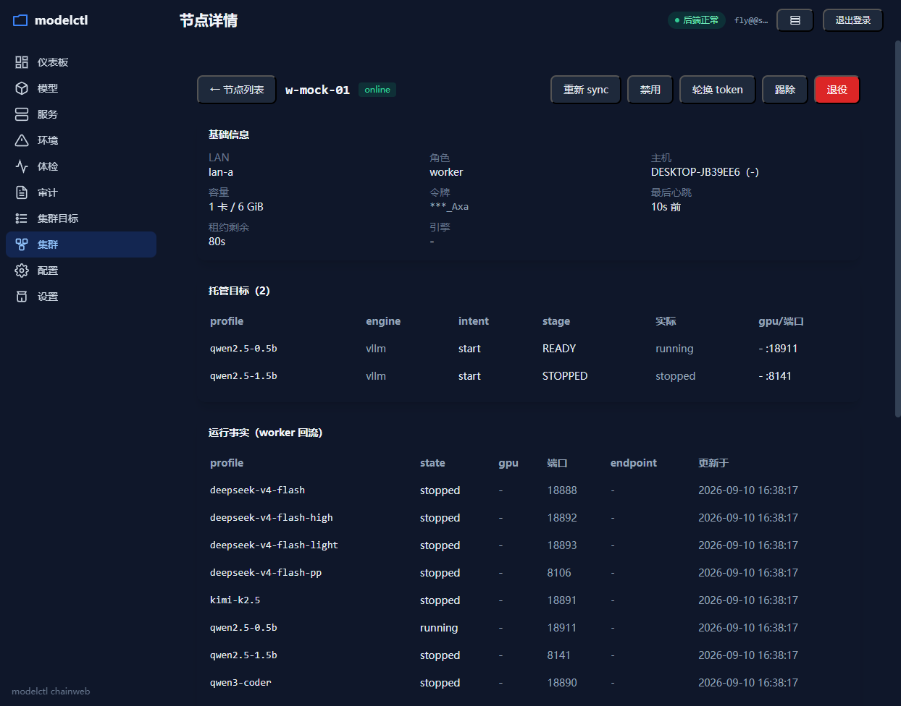

**预期结果**：倒序列出 `node.join / node.kick / node.disable / node.enable / token.rotate / goal.create / goal.update / goal.delete / node.sync / action.result` 等事件，时间与操作一一对应。

**CLI 断言**

```powershell
modelctl cluster events --node w-mock-01 --limit 12
```

---

## 测试组 F：节点治理（禁用 / 启用 / 踢除 / 轮换节点 token）

### F-1 禁用节点

1. 进入节点详情页 `w-mock-01`，点击「**禁用**」按钮并确认。


2. 回到「集群」列表页核对状态列。

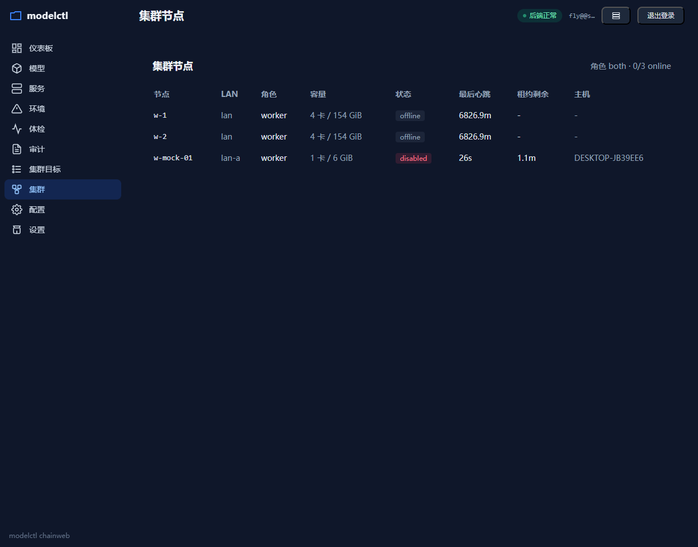

**预期结果**：节点状态变 `disabled`；事件流出现 `node.disable 禁用节点（顺带断连）`——禁用会**顺带断开 WS 长连接**。

### F-2 gate 拦截验证（禁用后下发被拒）

1. 保持节点禁用状态，去「集群目标 → 新建下发」，profile 任选（如 `qwen3.8`），勾选 `w-mock-01`（此时显示 `disabled · 1 卡 / 6 GiB`）。
2. 点击「预览（dry-run）」。

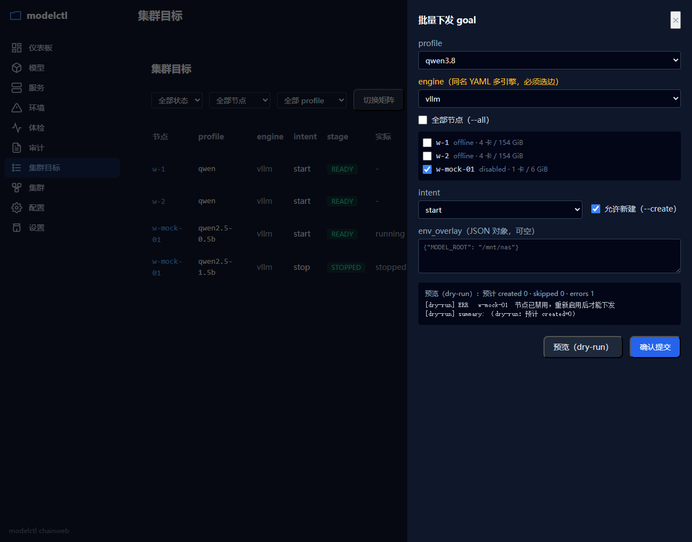

**预期结果**：预览报告为

```
预览（dry-run）：预计 created 0 · skipped 0 · errors 1
[dry-run] ERR   w-mock-01  节点已禁用，重新启用后才能下发
```

此时即使点「确认提交」也不会创建任何 goal（placement gate 在 goals 层预检拦截）。

### F-3 启用节点

1. 回节点详情页点「**启用**」。
2. worker 端约 1 个心跳周期内自动重连（实测 ≤ 60s），列表恢复 `online`。


**预期结果**：状态回 `online`，事件流出现 `node.enable 解除禁用` + 新的 `node.join`。

### F-4 踢除节点（kick）

1. 节点详情页点「**踢除连接**」。

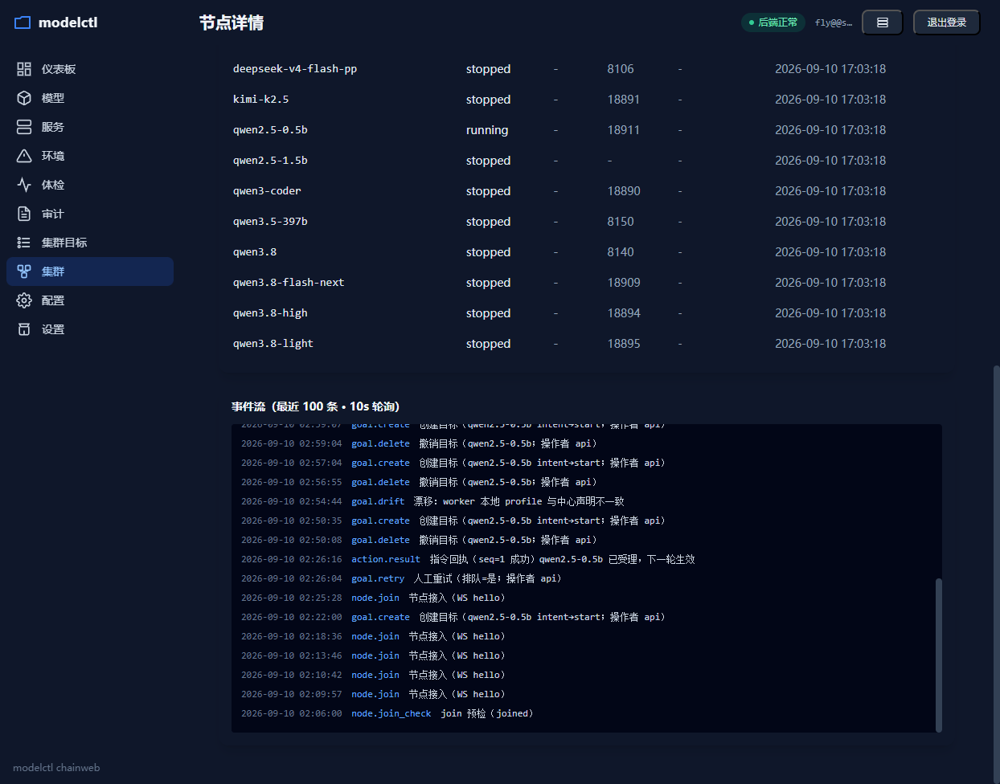

**预期结果**：事件流出现 `node.kick 主动踢除连接`；因 worker 侧有自动重连，短暂（实测约 50s）后再次 `node.join` 回 `online`——**kick 是断连不是拉黑**。

### F-5 轮换节点 token

1. 节点详情页点「**轮换 token**」并确认，弹窗一次性展示**新 token**（`NT-…` 32 位串），关闭后不再可见。

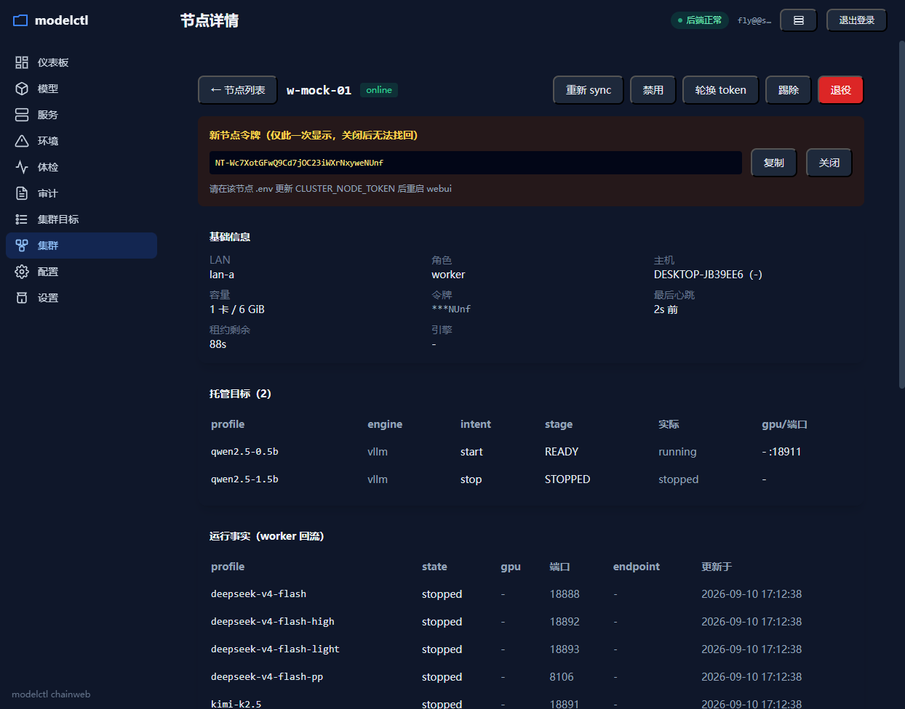

2. **必须**立刻把新 token 写入 worker 侧配置并重启 worker webui，否则 worker 将在旧连接断开后无法重连：

```powershell
# 编辑 mock-worker\.env 的 CLUSTER_NODE_TOKEN 为新值（注意保存为无 BOM UTF-8），然后：
cd D:\WorkPlace\Pycharm\modelctl\mock-worker
.\venv\Scripts\modelctl.exe webui restart
```

**预期结果**：worker 以新 token 重新 hello 成功，事件流出现 `token.rotate 轮换 节点 token` + 新 `node.join`，状态回 `online`。

---

## 测试组 G：设置页集群区（只读配置 / join token / 备份）

### G-1 集群设置只读区

1. 左侧导航「**设置**」→ 滚动到「集群」分区（URL：`/settings`）。

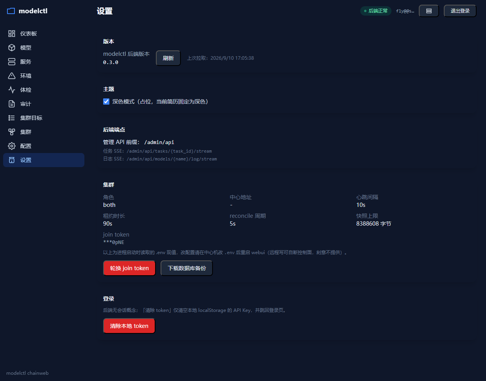

**预期结果**：展示 center 侧集群运行参数（监听端口、租约时长、保留策略等）**只读**快照——集群核心参数由 center `.env` 决定，UI 不提供修改入口，这是设计意图。

### G-2 轮换 join token（准入令牌）

1. 点击「轮换 join token」并确认，一次性展示新 join token。

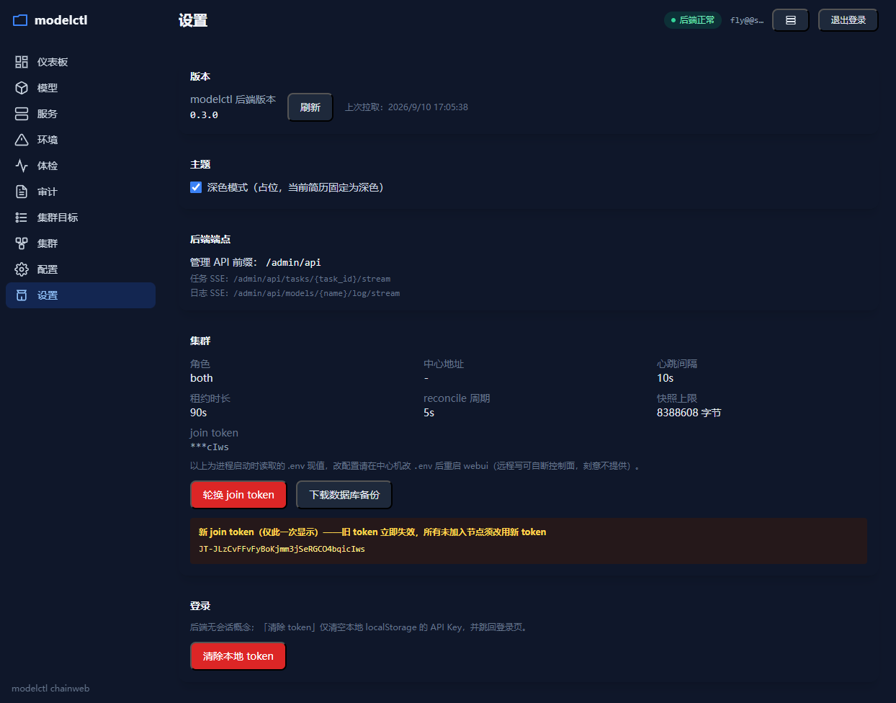

**预期结果**：新节点必须用新 join token 才能执行 `modelctl cluster join`；**已接入节点不受影响**（它们用的是各自的 node token）。

### G-3 下载集群备份

1. 点击「下载备份」，浏览器得到集群状态备份文件（JSON）。

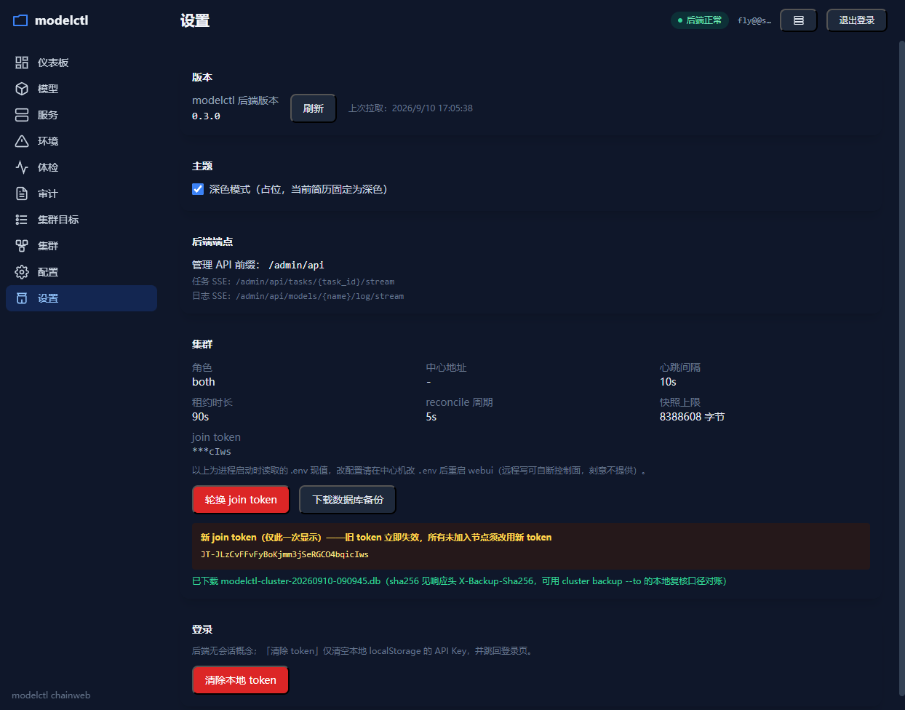

**预期结果**：下载成功，文件内含节点/goals/token 摘要等持久化状态，可用于迁移或排障。

---

## 测试组 H：故障注入（掉线 → offline → 恢复 adopt）

### H-1 杀掉 worker，观察 offline

1. 强杀 worker webui（模拟宕机）：

```powershell
# 找到占用 4183 的进程并杀掉（webui stop 可能杀不干净子进程，需补刀）
Get-NetTCPConnection -LocalPort 4183 -State Listen | ForEach-Object { Stop-Process -Id $_.OwningProcess -Force }
```

2. 盯住 center「集群」页（5s 轮询自动刷新）：
   - 0–90s：`online` → 租约剩余耗尽后变 `stale`；
   - 约 90s + 3×租约（合计约 4.5 分钟）后：变 `offline`。


**预期结果**：`w-mock-01` 状态 `offline`、租约剩余 0s、页头「0/3 online」。**期间中心不会误杀 goal**——goal 保持原 stage 等待节点回归。

### H-2 重启 worker，验证自动恢复与 adopt

1. 重启 worker webui：

```powershell
cd D:\WorkPlace\Pycharm\modelctl\mock-worker
.\venv\Scripts\modelctl.exe webui start
```

2. 约 5–10s 后 center 节点列表自动回 `online`。


3. 到「集群目标」页确认 goal 直接回 `READY`（worker 上容器还活着时走 **adopt 收养**路径，不重新拉起）。


**CLI 断言**

```powershell
modelctl cluster nodes                      # w-mock-01 online
modelctl cluster goal list --node w-mock-01 # qwen2.5-0.5b start READY
modelctl cluster events --node w-mock-01    # 新 node.join（示例：2026-09-10 17:24:07）
docker ps                                   # qwen2.5-0.5b-vllm 持续 Up 未中断
```

---

## 已知缺陷（本轮实测发现）

### 缺陷 1：同名 stem 多引擎时 goal 显示的 gpu/端口与真实容器不符 — ✅ FIXED (2026-09-10)

- **现象**：向 `w-mock-01` 下发 `qwen2.5-1.5b (engine=vllm)` 后，UI goal 行「gpu/端口」显示 `8141`，但真实 vllm 容器监听 `127.0.0.1:8107`。
- **根因**：goal 展示字段不是 goal 声明值，而是从 worker 回流的 `model_states` join 出来的（[`_goal_view`](file:///d:/WorkPlace/Pycharm/modelctl/src/modelctl/core/webui/admin_cluster.py) 中 `"port": (state or {}).get("port")`）。worker 快照以 profile **文件名 stem** 为 key，同名 stem 的 `vllm/qwen2.5-1.5b.yaml`（port 8107）与 `aphrodite/qwen2.5-1.5b.yaml`（port 8141）互相覆盖，aphrodite 条目胜出。
- **修复**（本次）：`model_states` PK 扩到 `(node_id, profile, engine)`；worker `_collect` 上报 `engine`；center `record_model_states` 按 `(stem, engine)` 精配；`_goal_views` 按 `(node_id, profile, engine)` join（engine 缺省回退空串）。
- **溯因文档**：[stem-ledger-collision.md](../known-pitfalls/backend/stem-ledger-collision.md)

### 缺陷 2：UI stop 后中心 stage=STOPPED，但真实容器未被杀掉 — ✅ FIXED (2026-09-10)

- **现象**：对缺陷 1 同源的 `qwen2.5-1.5b (vllm, 实际 8107)` 点 stop：intent=stop 下发、worker 回执正常、中心 stage 变 `STOPPED`，但 `docker ps` 显示 `qwen2.5-1.5b-vllm` 仍在 8107 运行。
- **根因**：与缺陷 1 同族。worker 停止逻辑按 stem 观测 `up/alive`（前者走 **端口** health，后者走 PID 文件），被同名 stem 另一 engine 的快照错位遮蔽，`_stopper` 永远不被调用。
- **修复**（本次）：`Reconciler` 构造新增可注入的 `docker_alive` 回调（生产默认走 `docker_container_alive(adapter._container_name)`，保守语义：docker 不可用一律视为存活）。`_step` 的 stop 分支在 `up/alive` 之外加 `or self._docker_alive(prof)`：即便 `up/alive` 都被"假死"遮蔽，只要容器还活着就进 stopper，从构造上消除"假 STOPPED"。
- **溯因文档**：[stem-ledger-collision.md](../known-pitfalls/backend/stem-ledger-collision.md)

### 前端：集群三页 5s/10s 轮询 `ERR_ABORTED` — ✅ FIXED (2026-09-10)

- **现象**：浏览器控制台连续刷 `net::ERR_ABORTED`（节点详情页 URL × 2、5s/10s 轮询间隔），页面本身正常。
- **根因**：tick 回调定时器与 axios 请求生命周期错位——axios 尚未完成下一 tick 又发起同 URL，浏览器 keep-alive 池把上一次 abort。详见 `docs/known-pitfalls/frontend/polling-overlap-err-aborted.md`。
- **修复**（本次）：`ClusterNodesView` / `ClusterGoalsView` / `ClusterNodeDetailView` 三页 `refresh()` 全量套用 `pending: Promise<void> | null = null; if (pending) return pending;` + silent abort catch（与 `DashboardView` 同口径）。

---

## 附录 A：本轮测试后的环境状态（恢复说明）

| 项目 | 状态 |
|---|---|
| w-mock-01 | online（以 F-5 轮换后的新 token 接入，`mock-worker\.env` 已同步） |
| goal qwen2.5-0.5b | `start / READY`，容器 18911 正常 |
| goal qwen2.5-1.5b | 已 remove；残留容器 `qwen2.5-1.5b-vllm` 已手工 `docker stop` |
| join token | 已于 G-2 轮换（新值仅当时可见，如需再下发新节点请再轮换一次） |
| 截图 | 本文档 `images/` 目录，25 张，命名 `<组>-<序>-<说明>.png` |

## 附录 B：常用断言命令速查

```powershell
modelctl cluster nodes                          # 节点三态 + 心跳/租约
modelctl cluster goal list [--node w-mock-01]   # goals（intent/stage/端口）
modelctl cluster events --node w-mock-01 --limit 20   # 事件流
modelctl cluster goal retry <profile> --node <node>   # FAILED 终态复活
docker ps --format "{{.Names}} {{.Ports}}"      # 真实容器与端口（复核缺陷 1/2）
```
